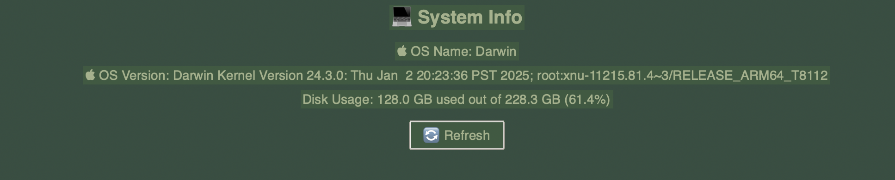

# 💻 System Info App

A sleek macOS desktop app built with Python and Tkinter that displays real-time system information with a refreshable GUI.



## ✨ Features

- 🌙 Dark green theme with custom styling
- 🖥️ Shows OS name and version
- 💾 Displays disk usage in GB and %
- 🔄 Refresh button to update info instantly
- 📦 Packaged as a macOS `.dmg` installer

## 🛠 Built With

- [Python](https://www.python.org/)
- [Tkinter](https://docs.python.org/3/library/tkinter.html)
- [psutil](https://pypi.org/project/psutil/)
- [PyInstaller](https://www.pyinstaller.org/)
- [create-dmg](https://github.com/create-dmg/create-dmg)

## 🚀 How to Run (Dev Mode)

Install dependencies:

```bash
pip install psutil
